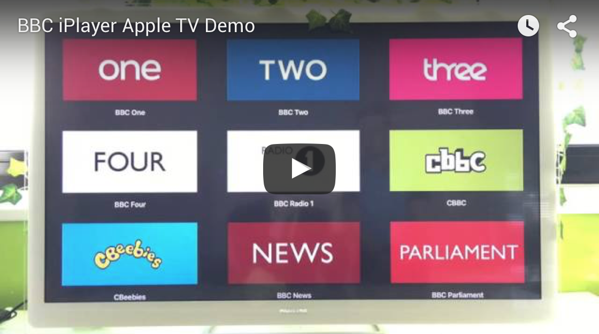
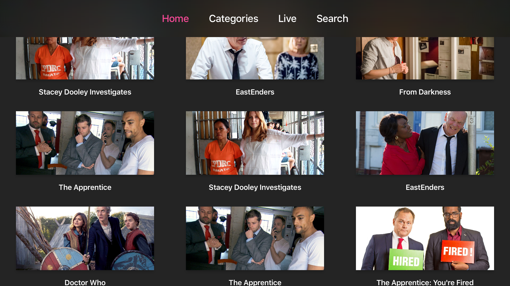
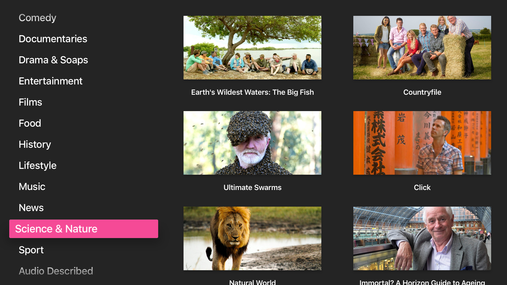
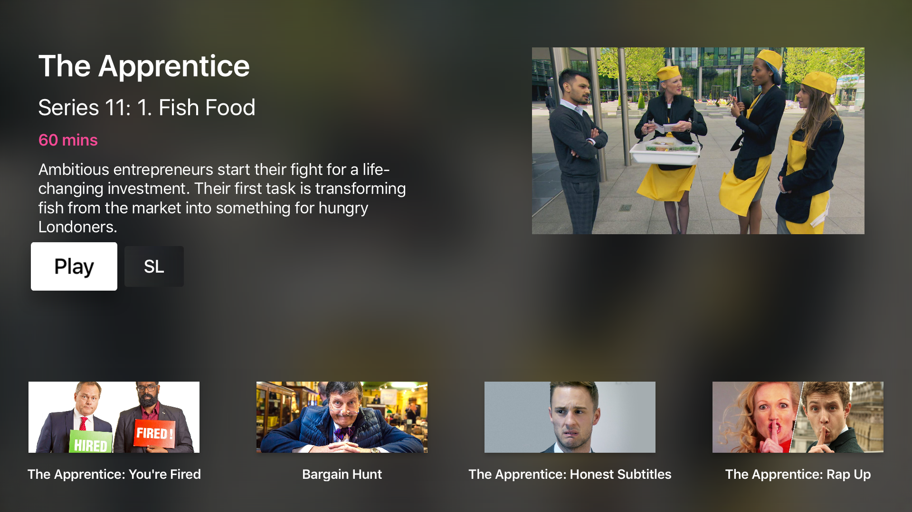
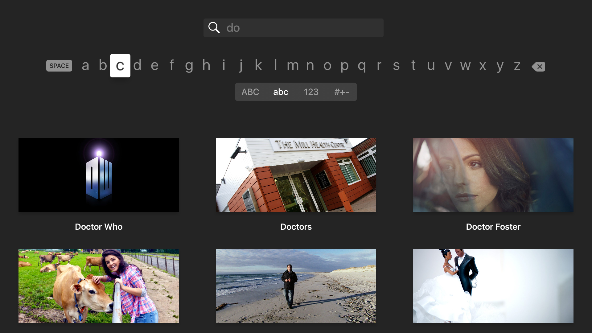

# Auntie Player

An Apple TV app to access on demand programmes from the BBC. 

## Why do this?

A few weeks ago the BBC replied to someone on Twitter asking about there being an Apple TV app for BBC iPlayer. Here's what they had to say:

<blockquote class="twitter-tweet" lang="en-gb">
<a href="https://twitter.com/benjaminmumford">@benjaminmumford</a> Hi Ben, there are no plans currently, but you should still be able to use Airplay <a href="http://t.co/qnaUSZIPis">http://t.co/qnaUSZIPis</a>
&mdash; BBC iPlayer (@BBCiPlayer) <a href="https://twitter.com/BBCiPlayer/status/642758870952222720">September 12, 2015</a></blockquote> 

This was a disappointing response — not just because we want to watch world class BBC programming on our Apple TV — but because they have a public responsibility to do so:

<blockquote>
	
Make engaging digital content and services available on a wide range of digital platforms and devices.

	
&mdash;<a href="http://www.bbc.co.uk/aboutthebbc/insidethebbc/whoweare/publicpurposes/communication.html">BBC Public Purpose</a>

</blockquote>

The app we're publishing here was built in just under *9 hours* at a hack event to prove it could be done. It's by no means complete or perfect, and it's very much a proof of concept. It's our hope the BBC will release an official app for Apple TV, as they've made iPlayer available on a wide range of other set-top boxes and Smart TVs. 

## Will you submit this to the App Store?

No. This project is merely a proof of concept to see what can be achieved with the tvOS platform and the BBC's amazing content. 

## How did you work out how the BBC API works?

We used a mixture of snooping network requests from the iOS client and searching around for resources online. We found a [great article from an engineer who worked on the API](http://smethur.st/posts/176135860) which helped us understand some of the concepts powering it. 

## Why Auntie Player?

[Because Auntie knows best.](http://www.theguardian.com/notesandqueries/query/0,5753,-23572,00.html)